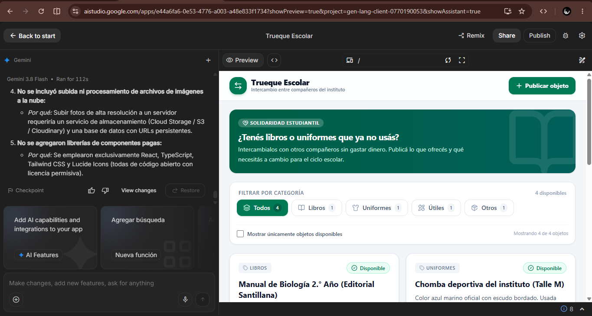
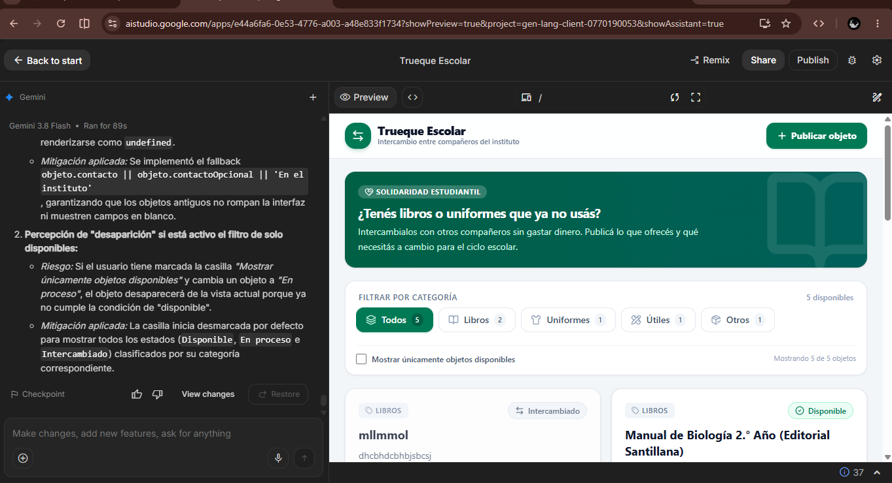
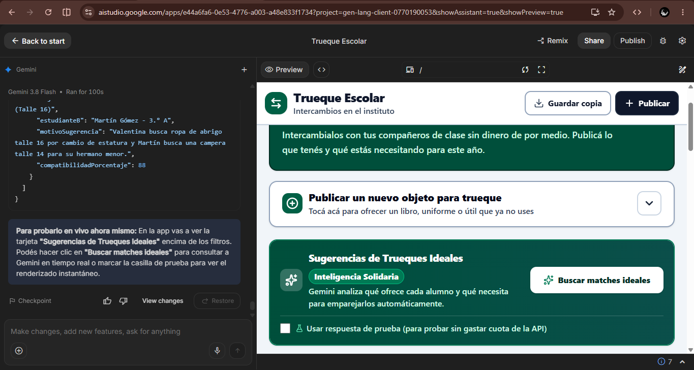

# TRUEQUE ESCOLAR

> Una plataforma web que permite el intercambio organizado de libros, uniformes y útiles escolares entre estudiantes del instituto sin dinero de por medio.

---

## 1. Probala ahora
- **App publicada:** https://4845347-boop.github.io/Trueque-Escolar
- **Código QR:** 
- **Usuario de prueba:** No requiere inicio de sesión.

---

## 2. Capturas
| Inicio y Estado Vacío | En uso / Catálogo | Con la IA trabajando |
|---|---|---|
|  |  |  |

---

## 3. Qué hace
- **Publicar objetos:** Permite a los estudiantes registrar libros, uniformes o útiles escolares especificando qué buscan a cambio.
- **Catálogo filtrable:** Organiza los artículos por categorías (Libros, Uniformes, Útiles, Otros) para facilitar la búsqueda.
- **Gestión de estados:** Permite marcar los artículos como "Disponible", "En proceso de trueque" o "Intercambiado".

---

## 4. Cómo correrlo en tu máquina
```bash
# Clonar el repositorio
git clone [https://github.com/4845347-boop/Trueque-Escolar.git](https://github.com/4845347-boop/Trueque-Escolar.git)

# Entrar a la carpeta del proyecto
cd Trueque-Escolar

# Configurar variables de entorno (si aplica para la función de IA)
cp .env.example .env

# Instalar dependencias e iniciar el servidor de desarrollo
npm install
npm run dev
